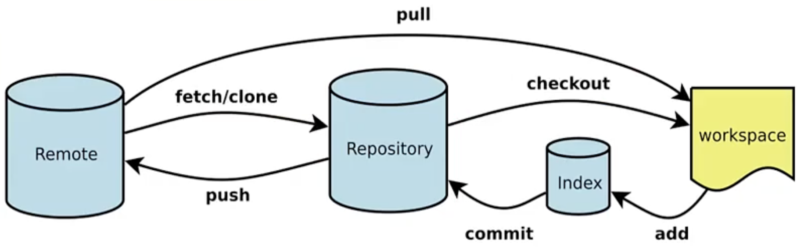

 # Makefile
 > [参考Makefile实战](https://www.yuque.com/linuxer/xngi03/nfsm1k?)
 # CMake
 > [参考-CMake实战](https://www.yuque.com/linuxer/xngi03/cs5y85?)

 语法：INCLUDE_DIRECTORIES找头文件
 ```
 INCLUDE_DIRECTORIES("${CMAKE_CURRENT_SOURCE_DIR}/dir1")
 ```
 语法：ADD_SUBDIRECTORY添加子目录
 ```
 ADD_SUBDIRECTORY("${CMAKE_CURRENT_SOURCE_DIR}/dir1")
 ```
 语法：ADD_LIBRARY生成库文件
 ```
 ADD_LIBRARY(hello_shared SHARED libHelloSLAM.cpp) # 生成动态库
 ADD_LIBRARY(hello_static STATIC libHelloSLAM.cpp) # 生成静态库
 ```
 语法：TARGET_LINK_LIBRARIES链接库文件到执行文件上
 ```
 TARGET_LINK_LIBRARIES(hello_shared ${OpenCV_LIBS}) # 链接动态库到执行文件上
 ```
 语法：AUX_SOURCE_DIRECTORY获取当前目录下所有源文件
 ```
 AUX_SOURCE_DIRECTORY(. DIRSRCS) # 获取当前目录下所有源文件
 ```
 语法：INSTALL设置安装路径
 ```
 INSTALL(TARGETS hello_shared DESTINATION lib) # 安装动态库到指定目录
 INSTALL(TARGETS hello_static DESTINATION lib) # 安装静态库到指定目录
```

# GIT


## 逆向操作
index $\rightarrow$ workspace
```
git restore -S
```
$\begin{cases}本地仓库 \rightarrow index\\
本地仓库 \rightarrow workspace \\
本地仓库 \rightarrow null\\
\end{cases}$
```
git reset --soft
git reset --mixed
git reset --hard
```
workspace $\rightarrow$ null
```
git checkout
git checkout --file
git checkout -f
```
## 本地仓库整理
整理上一次的提交：将本次修改内容合并到上次的提交中
```
git commit --amend
```
整理多次提交：将多次提交合并为一次提交
左开右闭
```
git rebase -i h1 h2
```
## 分支操作
查看所有分支，加-a可以查看所有分支包括远程分支
```
git branch
```
创建分支
```
git branch <branchName>
```
切换分支
```
git checkout <branchName>
```
创建并切换分支
```
git checkout -b <branchName>
```
合并分支
先拉去master最新的代码，在把master的代码合并到当前分支，测试通过后再合并到master
```
git merge <branchName>
```
删除分支
```
git branch -d <branchName>
```
## 解决冲突
冲突产生的原因：不同分支修改了同一文件的同一行或相邻行
解决冲突的原则：不要影响其他人提交的功能，并协商解决
解决后提交代码：
```
git commit -i -m ""
```

